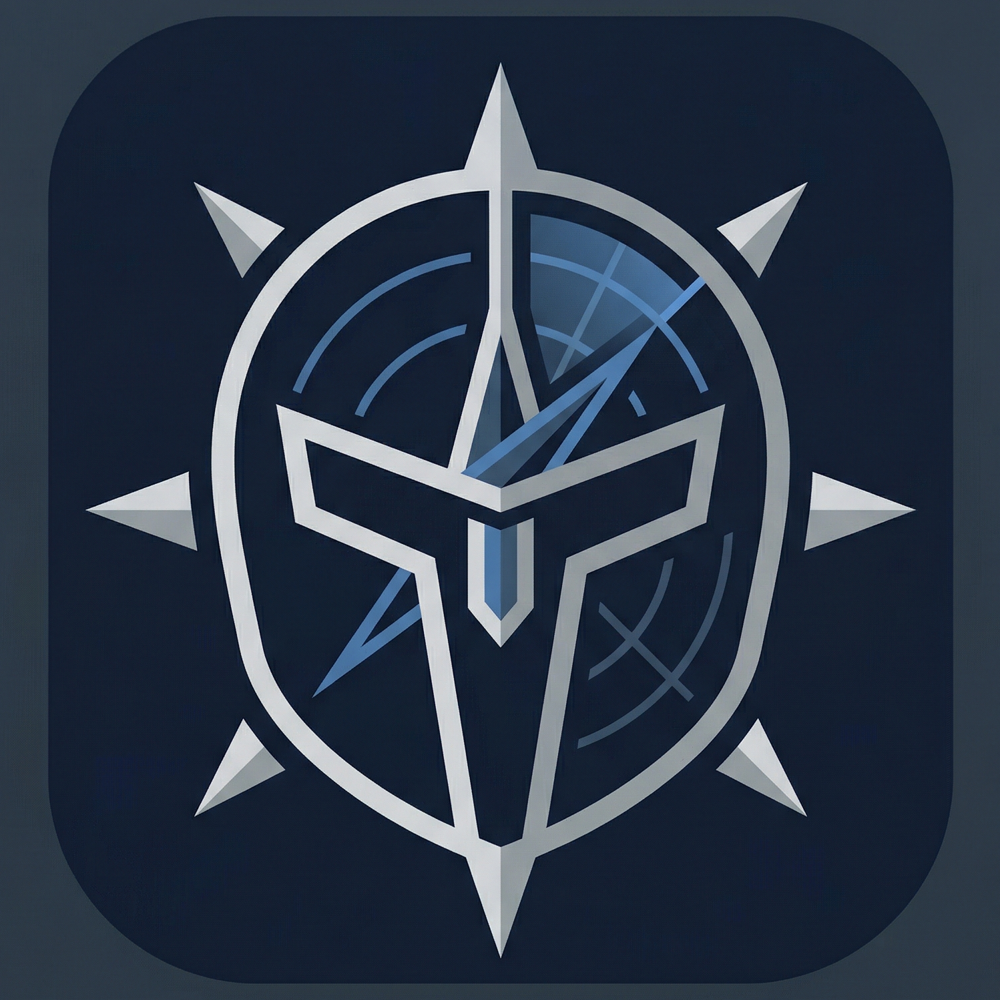

<p align="center">
  
</p>

<h1 align="center">Helm</h1>

<p align="center"><strong>한 번이 아니라 계속 돌리는 에이전트를 위한 safety and memory layer</strong></p>

<p align="center">Helm은 에이전트가 반복 실행될수록 생기는 컨텍스트 누수, 경계 붕괴, 롤백 부재, 추적 불가능성을 줄이기 위한 운영 레이어입니다.</p>

<p align="center"><strong>현재 릴리즈: v0.6.0</strong></p>

<p align="center">
  <a href="README.md">English README</a>
</p>

<p align="center">
  
  
  
  
</p>

<p align="center">
  <a href="#왜-helm인가">왜 Helm인가</a> ·
  <a href="#quick-start">Quick Start</a> ·
  <a href="#온보딩과-workspace-모델">온보딩</a> ·
  <a href="#핵심-명령">핵심 명령</a> ·
  <a href="#명령-가드">명령 가드</a> ·
  <a href="#프로바이더-탐지">프로바이더 탐지</a> ·
  <a href="#운영-데이터베이스">운영 데이터베이스</a> ·
  <a href="#adaptive-harness">Adaptive Harness</a> ·
  <a href="#스킬-품질과-운영-정책">스킬 품질</a> ·
  <a href="#문서와-데모">문서와 데모</a>
</p>

## 왜 Helm인가

대부분의 에이전트 스택은 이미 툴 호출은 할 수 있습니다. 진짜 어려운 문제는 같은 에이전트를 계속 굴렸을 때 그것이 하나의 시스템처럼 동작하길 기대하는 순간부터 시작됩니다.

보통 실패는 이런 식으로 나타납니다.

- 이전 실행에서 무슨 일이 있었는지 자꾸 잊어버린다
- 작은 로컬 모델은 multi-step 작업에서 쉽게 흔들린다
- risky edit가 생겨도 rollback discipline이 눈에 보이지 않는다
- 작업은 끝났는데 나중에 왜 그렇게 실행됐는지 설명하기 어렵다
- skill은 늘어나는데 규칙은 여전히 문서나 프롬프트에만 남는다

Helm은 바로 이 두 번째 층의 문제를 다룹니다.

즉 Helm이 하는 일은:

- 파일과 이전 운영 흔적에서 필요한 컨텍스트를 다시 읽는 것
- 명령 전에 올바른 execution mode를 고르게 만드는 것
- 상위 task와 저수준 command를 함께 추적하는 것
- risky edit 전에 rollback path를 보이게 만드는 것
- skill policy를 프롬프트 folklore가 아니라 inspectable contract로 다루는 것

현재 릴리즈 기준으로는 특히 다음이 핵심입니다.

- 각 스킬이 `skills/<skill>/contract.json`으로 자신의 실행 계약을 직접 가집니다
- 작은 로컬 모델일수록 더 좁은 runner와 더 보수적인 기본값으로 유도할 수 있습니다
- manifest가 존재하는지만 보는 것이 아니라, 아직도 너무 generic한 계약인지까지 감사할 수 있습니다
- typed memory operation과 crystallized session을 task 서술과 분리해서 명시적으로 기록할 수 있습니다
- `helm memory review-queue`로 unresolved memory follow-up을 바로 확인할 수 있습니다
- status/report가 active workspace layout을 따라가므로 OpenClaw형 workspace에서도 Helm memory state를 놓치지 않습니다

특히 아래 같은 환경에 잘 맞습니다.

- 이미 agent runtime 또는 workspace가 있는 경우
- 장기적으로 굴리는 workflow나 skill이 있는 경우
- notes, memory, logs, checkpoints가 다음 실행에도 영향을 줘야 하는 경우

에이전트를 일회성 데모로만 쓴다면 Helm은 과할 수 있습니다.
반대로 이미 실제 반복 작업을 맡기고 있다면 Helm의 필요성이 훨씬 분명해집니다.

원칙적으로 runtime-agnostic이지만, OpenClaw 스타일이나 Hermes 스타일 환경이 있으면 가장 자연스럽게 붙습니다.

## 예시 시나리오

장기 운영 중인 workspace에서 coding agent가 router refactor를 맡는 상황을 가정해보겠습니다.

Helm이 없으면 에이전트가 부분적 컨텍스트만 읽고 너무 빨리 수정에 들어가거나, 나중에 왜 그렇게 실행됐는지 추적하기 어려울 수 있습니다.
Helm이 있으면 explicit files, execution profiles, checkpoints, audit traces, finalization decision을 기준으로 작업이 통제됩니다.

전형적인 흐름은 이렇습니다.

1. notes, memory, command logs, task history, checkpoints에서 context를 다시 읽습니다.
2. 작업 전에 적절한 execution profile을 고르거나 강제합니다.
3. risky work에는 checkpoint discipline과 visible trace를 붙입니다.
4. 실행 후에는 이후 판단에 남겨야 할 durable state가 무엇인지 명시적으로 평가합니다.
5. 결과적으로 검토, 재현, 복구, 후속 작업 연결이 쉬워집니다.


## Helm이 하는 일

- `inspect_local`, `workspace_edit`, `risky_edit` 같은 execution profile
- notes, memory, ontology, tasks, commands, checkpoints를 아우르는 file-native context hydration
- task / command audit trail
- checkpoint 생성, 조회, restore guidance
- durable state capture planning을 포함한 task finalization
- draft skill 생성, review, approve, reject
- status / report / validate 중심의 운영 가시성

## Quick Start

Helm을 설치하고 workspace를 만듭니다.

```bash
curl -fsSL https://raw.githubusercontent.com/JDeun/Helm/main/install.sh | bash
helm init --path ~/.helm/workspace
```

그 다음 기존 시스템을 survey하고 onboarding을 적용합니다.

```bash
helm survey --path ~/.helm/workspace
helm onboard --path ~/.helm/workspace --use-detected
```

workspace 경로를 바로 지정하려면:

```bash
curl -fsSL https://raw.githubusercontent.com/JDeun/Helm/main/install.sh | bash -s -- --workspace ~/work/helm
```

## 온보딩과 Workspace 모델

Helm은 보통 별도 workspace로 시작하고, 기존 시스템은 우선 read-only context source로 붙이는 방식이 맞습니다.

권장 기본 모델은 다음과 같습니다.

- Helm은 별도 workspace로 둘 것
- runtime state는 `.helm/` 아래에 둘 것
- profiles, notes, policies, skill rules는 명시 파일로 둘 것
- 기존 OpenClaw, Hermes, notes vault는 adopt해서 연결할 것

추천 초기 흐름:

```bash
helm init --path ~/.helm/workspace
helm survey --path ~/.helm/workspace
helm onboard --path ~/.helm/workspace --use-detected --dry-run
helm onboard --path ~/.helm/workspace --use-detected
```

기본적으로 `helm onboard`는 적용 후 `doctor`, `validate`, `status --verbose`까지 이어서 실행합니다.
adoption만 하고 싶다면:

```bash
helm onboard --path ~/.helm/workspace --use-detected --skip-checks
```

명시적으로 source를 붙이려면:

```bash
helm adopt --path ~/.helm/workspace --from-path ~/.openclaw/workspace --name openclaw-main
helm adopt --path ~/.helm/workspace --from-path ~/.hermes --name hermes-main
helm adopt --path ~/.helm/workspace --from-path ~/Documents/Obsidian/MyVault --kind generic --name obsidian-main
helm sources --path ~/.helm/workspace
```

기존 OpenClaw나 Hermes 트리를 Helm이 기본값으로 덮어쓰는 일은 없어야 합니다. Obsidian은 필수가 아니고, Helm이 중요하게 보는 것은 특정 앱이 아니라 명시적인 파일 상태입니다. 다만 이미 Obsidian에 운영 노트를 쌓고 있다면 read-only source로 연결하는 것이 좋은 기본값입니다.

## 핵심 명령

execution profile 확인:

```bash
helm profile list --path ~/.helm/workspace
```

라우팅 전에 context hydration:

```bash
helm context --path ~/.helm/workspace --describe-modes
helm context --path ~/.helm/workspace --mode failures --limit 5
helm context --path ~/.helm/workspace --include notes tasks commands --summary --limit 8
```

외부 source adopt 및 조회:

```bash
helm adopt --path ~/.helm/workspace --from-path ~/.openclaw/workspace --name openclaw-main
helm context --path ~/.helm/workspace --adapter openclaw-main --include notes tasks commands --limit 8
```

checkpoint를 수반하는 risky task 실행:

```bash
helm profile --path ~/.helm/workspace run risky_edit \
  --task-name "router refactor" \
  -- python3 -c 'print("hello")'
```

rollback 후보 확인:

```bash
helm checkpoint-recommend --path ~/.helm/workspace
helm checkpoint list --path ~/.helm/workspace
helm checkpoint show --path ~/.helm/workspace <checkpoint-id>
```

draft skill 생성과 검토:

```bash
helm skill --path ~/.helm/workspace draft-from-task \
  --task-id <task-id> \
  --name example-skill \
  --description "Example reusable workflow"

helm skill --path ~/.helm/workspace assess-draft --name example-skill
helm skill-diff --path ~/.helm/workspace --name example-skill
helm skill-approve --path ~/.helm/workspace --name example-skill --dry-run
```

운영 요약 확인:

```bash
helm status --path ~/.helm/workspace --verbose
helm report --path ~/.helm/workspace --format markdown
```

## 명령 가드

Helm은 모든 명령 실행 전에 결정론적 명령 가드를 평가합니다:

- **절대 차단**: `rm -rf /` 같은 치명적 명령은 항상 차단됩니다
- **프로파일 강제**: `inspect_local`은 쓰기/네트워크를 차단하고, `workspace_edit`은 네트워크를 차단합니다
- **위험 점수**: 명령은 감지된 카테고리에 따라 위험 점수(0.0–1.0)를 받습니다
- **승인 워크플로우**: 위험한 명령은 `--approve-risk`를 필요로 합니다

```bash
# 가드가 위험한 명령을 차단합니다
helm profile run inspect_local -- rm -rf build
# GUARD DENY: write detected under inspect_local

# 알려진 위험 작업에 대해 승인으로 재정의
helm profile run risky_edit --approve-risk -- rm -rf build

# 감사 모드는 기록만 하고 차단하지 않습니다
helm profile run workspace_edit --guard-mode audit -- curl https://example.com

# 실행 없이 가드 결정 확인
helm profile run workspace_edit --guard-json -- rm -rf build
```

가드 모드: `enforce` (기본값), `audit` (기록만), `off` (비활성화하되 기록).

## 프로바이더 탐지

Helm은 API를 호출하지 않고 사용 가능한 LLM 프로바이더를 감지합니다:

- **API 프로바이더**: 환경 변수 존재 여부로 감지 (Anthropic, OpenAI, Gemini, OpenRouter, Azure, Bedrock, Vertex 등)
- **로컬 프로바이더**: 짧은 타임아웃 엔드포인트 프로브로 감지 (Ollama, LM Studio, llama.cpp, vLLM)
- **API 호출 없음**: 프로바이더 감지는 클라우드 API에 요청을 보내지 않습니다
- **시크릿 저장 없음**: API 키 값은 로깅이나 저장되지 않습니다

전체 디스커버리 보고서를 보려면 `helm doctor`를 실행하세요.

## 운영 데이터베이스

Helm은 JSONL 작업 원장에 대한 SQLite 쿼리 인덱스를 유지합니다:

```bash
helm db init              # SQLite 인덱스 생성
helm db rebuild           # JSONL 소스 파일에서 재빌드
helm db verify            # JSONL/SQLite 드리프트 확인
helm db status            # 인덱스 통계 표시
```

JSONL은 추가 전용 진실 소스(source of truth)로 유지됩니다. SQLite 실패는 명령 실행을 차단하지 않습니다.

## Adaptive Harness

Helm은 model tier에 따라 강제 수준을 조절하는 adaptive harness도 포함합니다.

프롬프트 규율만 믿지 않고 preflight/postflight 검증을 코드로 강제하려면 이 경로를 씁니다.

```bash
helm harness --path ~/.helm/workspace policy
helm harness --path examples/demo-workspace contract --skill router-context-demo
helm harness --path examples/demo-workspace preflight \
  --skill router-context-demo \
  --profile inspect_local \
  --model gemma4:e4b \
  --task-name "router triage" \
  --request "라우터 변경 전에 필요한 컨텍스트를 먼저 점검해줘" \
  -- python3 -c 'print("ok")'
```

현재 릴리즈에서 중요한 변화는 harness 정책이 중앙 registry가 아니라 스킬 자체가 소유한다는 점입니다.

- 각 스킬은 `skills/<skill>/contract.json` 안에서 `allowed_profiles`, `default_profile`를 선언할 수 있습니다
- strict runner 필요 여부도 중앙 코드가 아니라 manifest에서 선언합니다
- browser-heavy workflow는 작업 완료 전에 구조화된 `browser_evidence`를 남기도록 강제할 수 있습니다
- blocked retrieval workflow는 escalation 종료 상태를 `retrieval_evidence`로 남겨서 사후 inspection이 가능하게 만들 수 있습니다
- 파일 기반 workflow는 parser routing과 mismatch 처리를 추적 가능하게 남기도록 구조화된 `file_intake_evidence`를 요구할 수 있습니다
- 명시적 evidence가 빠졌더라도 `python3 scripts/adaptive_harness.py backfill-evidence`로 기존 ledger에서 추론 가능한 항목을 보강할 수 있습니다
- `python3 scripts/run_with_profile.py validate-manifests --json`으로 release 전에 manifest 누락이나 형식 오류를 감지할 수 있습니다
- `python3 scripts/run_with_profile.py audit-manifest-quality --json`으로 아직 too broad하거나 approval 경계가 약한 contract를 감지할 수 있습니다

## 스킬 품질과 운영 정책

Helm workspace를 장기적으로 다듬을 때 중요한 것은 스킬을 많이 쌓거나 규칙을 많이 늘리는 것이 아닙니다.
핵심은 어떤 스킬이 들어와도 Helm이 그것을 안정적으로 운영할 수 있게 만드는 것입니다.

Helm이 계속 대답할 수 있어야 하는 질문은 이런 것들입니다.

- 최소 어떤 입력을 먼저 받아야 하는가
- 어떤 순서로 판단해야 하는가
- 어디서 멈추고 승인이나 handoff를 받아야 하는가
- 좋은 답변의 기본 형태는 무엇인가
- 실패했을 때 workflow를 망치지 않고 어떻게 설명해야 하는가

그래서 Helm에서 좋은 스킬은 단순히 설명이 좋은 스킬이 아닙니다.
`SKILL.md` 안에 운영 계약이 드러나고, `contract.json`으로 실행 경계가 좁혀져 있는 스킬입니다.

권장 기본값:

- 새 스킬은 `inspect_local`에서 시작할 것
- 실제로 필요할 때만 `workspace_edit`, `service_ops`, `risky_edit`로 넓힐 것
- account-bound 또는 irreversible action은 `approval_keywords`로 눈에 띄게 둘 것
- 약한 로컬 모델이 즉흥 실행하면 위험한 흐름은 strict runner로 묶을 것
- release 전이나 정책 수정 후에는 `validate-manifests`와 `audit-manifest-quality`를 함께 돌릴 것
- durable memory, workflow artifact, promoted skill rule을 같은 층으로 섞지 말 것

`SKILL.md` 권장 기본값:

- `Input contract`, `Decision contract`, `Output contract`, `Failure contract`를 명시할 것
- 입력 누락 시 첫 질문은 짧고 unblock-oriented 하게 쓸 것
- 기본 출력 형식과 길이 제한을 둘 것
- 스킬이 스스로 단정하거나 완료했다고 말하면 안 되는 경계를 적을 것

검토 기준은 [docs/skill-quality-and-policy.md](docs/skill-quality-and-policy.md), memory/promotion 경계는 [docs/knowledge-contract.md](docs/knowledge-contract.md)를 보면 됩니다.

운영 가시성 보조 명령:

- `helm run-contract --path <workspace> --json` 으로 최신 실행 계약 스냅샷 확인
- `helm capability-diff --path <workspace> --json` 으로 최근 실행 간 capability 차이 확인

## File-Native Context Hydration

Helm의 context 모델은 의도적으로 explicit합니다.

hidden prompt state에 기대기보다 아래 파일과 운영 흔적을 다시 읽습니다.

- notes와 curated memory files
- `memory/` 아래의 file-native memory
- ontology entities / relations
- task ledger
- command log
- checkpoints
- adopt된 external source

방향 자체는 wiki-style, externalized working-context와 맞닿아 있지만, 특정 upstream 시스템의 복제품이 아니라 실전 운영용 CLI와 workspace 계층으로 구현한 것입니다.

## Task Finalization

Helm에서 task finalization은 단순히 "프로세스가 끝났다"가 아닙니다.

의미 있는 작업이라면 아래를 남겨야 합니다.

- 실행 trace
- rollback / recovery 판단에 필요한 가시성
- durable state를 추가로 기록해야 하는지에 대한 명시적 결정

현재 Helm 릴리스는 이를 task ledger 안의 `memory_capture` 계획으로 구현합니다. 이 계획은 다음 단계에서 `daily_memory`, `long_term_memory`, `ontology`, 사람이 읽기 좋은 `notes` 중 어디를 업데이트해야 할지 추천합니다.
이제 여기에 더해 `helm memory op ...`, `helm memory crystallize`, `helm memory review-queue`로 후속 판단과 review backlog도 운영 기록으로 분리할 수 있습니다.

## 설치 메모

로컬 checkout에서 설치:

```bash
python3 -m pip install --user --no-build-isolation .
```

`helm`이 바로 잡히지 않으면 installer가 shell profile에 추가해야 할 user bin 경로를 출력합니다.

## 문서와 데모

- [`docs/onboarding.md`](docs/onboarding.md)
- [`docs/release-checklist.md`](docs/release-checklist.md)
- [`docs/releases/0.5.10.md`](docs/releases/0.5.10.md)
- [`docs/router-context-hydration.md`](docs/router-context-hydration.md)
- [`docs/adaptive-harness.md`](docs/adaptive-harness.md)
- [`docs/skill-quality-and-policy.md`](docs/skill-quality-and-policy.md)
- [`docs/task-finalization.md`](docs/task-finalization.md)
- [`docs/ops-memory-query.md`](docs/ops-memory-query.md)
- [`examples/demo-workspace`](examples/demo-workspace)
- [`CHANGELOG.md`](CHANGELOG.md)

demo workspace로 바로 실행해보려면:

```bash
helm survey --path examples/demo-workspace
helm doctor --path examples/demo-workspace
helm validate --path examples/demo-workspace
helm context --path examples/demo-workspace recent-state --limit 5
helm memory --path examples/demo-workspace pending-captures --limit 5
helm memory --path examples/demo-workspace review-queue --limit 5
helm memory --path examples/demo-workspace audit-coherence --json
helm ops --path examples/demo-workspace capture-state --limit 10
helm report --path examples/demo-workspace --format markdown
```

## 현재 상태

Helm v0.5.10은 context loading과 query 경로를 더 단단하게 만들어, 손상된 로컬 상태가 있어도 운영자 조회 화면이 전체 중단되지 않도록 다듬은 릴리즈입니다.

이미 들어간 것:

- Helm-native CLI packaging
- read-only adoption을 전제로 한 separate workspace model
- file-native context hydration
- durable capture planning이 포함된 task finalization
- operator가 직접 보는 finalization inspection 명령
- typed memory operation과 crystallized session artifact
- unresolved capture / supersession / confidence 이슈를 위한 review queue 가시성
- manifest 기반 adaptive harness governance
- route decision, result consistency, downgrade 정책까지 포함하는 adaptive harness contract
- 누락되거나 잘못된 skill contract를 잡는 manifest audit
- generic하거나 약한 skill contract를 잡는 manifest quality audit
- `SKILL.md` 품질 기준과 계약형 draft 템플릿
- `SKILL.md` 구조와 manifest-문서 정합성까지 보는 quality audit
- 저장소 루트의 개인 스킬 자산 대신 일반화된 demo 전용 skill contract
- checkpoint, report, skill review 흐름
- example workspace와 release-oriented docs

의도적으로 빠진 것:

- private memory / ontology data
- 개인 agent overlay
- credentials 또는 private task history

## 포지셔닝

짧게 말하면 Helm은 이렇습니다.

> agent runtime이 실제 작업을 하고, Helm은 그 작업이 어떻게 준비되고, 실행되고, 추적되고, finalization되고, 복구되는지를 다룹니다.

Helm은 다음이 아닙니다.

- 새로운 foundation model
- chat UI
- 완전 자율형 agent platform
- 모든 runtime의 대체재

Helm은 다음입니다.

- operations layer
- governance / observability layer
- 로컬 및 개인 에이전트를 위한 stability-first orchestration layer

## Acknowledgements

Helm은 실제 OpenClaw 기반 개인 에이전트 워크스페이스 운영 경험과, Hermes 계열 runtime discipline, wiki-style externalized working context, skills-based workflow design, checkpoint 중심 로컬 운영 관점의 영향을 받아 다듬어진 결과물입니다.

여기에 언급된 프로젝트나 인물의 공식 확장판이나 협업 결과물은 아닙니다.

## 라이선스

MIT
