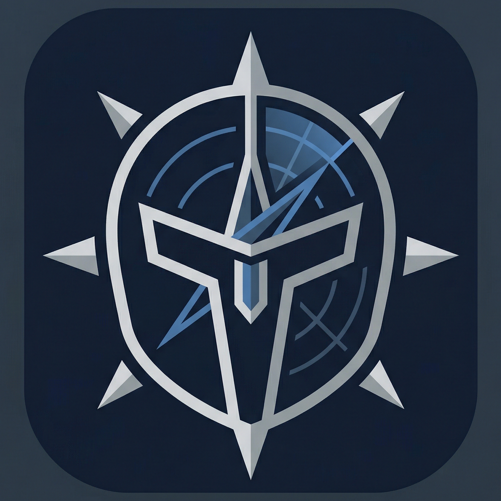

<p align="center">
  
</p>

<h1 align="center">Helm</h1>

<p align="center"><strong>The local operations layer for long-running AI agents.</strong></p>

<p align="center">
  Coding, ops, research, automation — any agent that runs for hours on the same workspace.<br/>
  Profiles before commands · Checkpoints before risky work · Durable history after the chat is gone.
</p>

<p align="center">
  <a href="https://pypi.org/project/helm-agent-ops/"></a>
  <a href="https://pypi.org/project/helm-agent-ops/"></a>
  <a href="https://github.com/JDeun/Helm/actions/workflows/publish.yml"></a>
  <a href="https://github.com/JDeun/Helm/actions/workflows/ci.yml"></a>
  
  <a href="https://arxiv.org/abs/2605.12129"></a>
</p>

<p align="center">
  <a href="https://v0-helm-agent-ops.vercel.app/">Landing</a> ·
  <a href="#quickstart">Quickstart</a> ·
  <a href="#what-helm-does">What Helm does</a> ·
  <a href="#workflows">Workflows</a> ·
  <a href="#documentation">Docs</a> ·
  <a href="README.ko.md">한국어</a>
</p>

---

## Quickstart

```bash
pip install helm-agent-ops
helm init --path ~/.helm/workspace
export HELM_WORKSPACE=~/.helm/workspace
```

Run your first inspection under a declared risk profile:

```bash
helm profile run inspect_local --task-name "first look" -- git status --short
helm status --brief
helm dashboard
```

The first command produces a guarded execution record. The second shows what just happened in plain English. The third lays out the workspace state on one page.

> **No PyPI?** Use the bootstrap installer: `curl -fsSL https://raw.githubusercontent.com/JDeun/Helm/main/install.sh | bash`

---

## Why Helm

Long-running AI agents drift. They forget prior decisions, execute risky actions before you can stop them, and leave behind a chat log nobody can audit a week later — regardless of whether the agent is editing code, running ops, organizing notes, browsing sites, or chaining tool calls.

Helm is a thin, file-backed operations layer that sits around your existing agent runtime. It does **not** replace your agent. It makes the agent's work boundable, recoverable, and reviewable.

The model proposes actions; the harness validates, authorizes, executes, records, and returns observations. Safety and completion claims should come from execution evidence, not from prompt advice or a compacted chat transcript.

| Without Helm | With Helm |
| --- | --- |
| Risky commands run as soon as the agent decides | Commands run under a declared execution profile with a guard check |
| Multi-step or multi-file changes leave you guessing what happened | Checkpoint created before the work; visible rollback point |
| "What did the agent do yesterday?" → scroll the chat | Local task ledger, command log, dashboard, markdown report |
| Context lives in the chat window | File-backed memory + ranked retrieval rehydrates the next session |
| Skill rules live in prompts | `SKILL.md` + `contract.json` enforce policy at run time |

If your agent only runs one-off demos, you do not need Helm. If you run it for hours on the same workspace — coding, ops, knowledge capture, or any mix — you do.

---

## What Helm does

<table>
<tr>
<td width="33%" valign="top">

### 🛡️ Guard before execution

- **Execution profiles** declare blast radius (`inspect_local`, `workspace_edit`, `risky_edit`, `service_ops`, `remote_handoff`)
- **Command guard** blocks destructive or out-of-profile actions before they run
- **Tool-group grants** restrict which capabilities each profile exposes

</td>
<td width="33%" valign="top">

### 💾 Recover after the fact

- **Checkpoints** before broad edits give a clear rollback target
- **Task ledger** & **command log** keep durable history independent of the chat, including tool grants and experience attribution
- **Browser & profile gates** can pause runaway work and require evidence of cleanup

</td>
<td width="33%" valign="top">

### 🧭 Operate over time

- **File-backed memory** with ranked retrieval (`helm context --explain-ranking`)
- **Skill lifecycle** governs how skill rules promote / decay
- **Workflow contracts** declare sources, mutations, verification, handoff, and stop conditions
- **Evidence-aware reply gates** keep completion claims tied to inspectable proof
- **Adaptive harness** integrates failure signatures → policy transitions
- **Shadow reports & promotion queues** surface when guarded features or skill
  candidates are ready to enforce

</td>
</tr>
</table>

<p align="center">
  
</p>

---

## A three-minute demo


```bash
helm profile run inspect_local --task-name "inspect current repository" -- git status --short
helm checkpoint create --label before-risky-work --include $HELM_WORKSPACE
helm report --format markdown
helm dashboard
```

Each command leaves a structured record on disk: task ledger, command log, checkpoint record, dashboard summary. None of it requires the agent to remember anything.

---

## Workflows

<details>
<summary><b>Inspect the workspace</b></summary>

```bash
helm doctor
helm status --brief
helm dashboard
helm reconcile              # dry-run: report reference drift vs the desired snapshot
helm verify-contract        # assert behavioral operating invariants still hold
```

</details>

<details>
<summary><b>Run a command under a declared profile</b></summary>

```bash
helm profile run inspect_local --task-name "inspect repository state" -- git status --short
helm profile run workspace_edit --task-name "tighten typing in api/" -- ruff check api/
```

</details>

<details>
<summary><b>Adopt existing systems as context sources</b></summary>

```bash
helm survey
helm onboard --use-detected --dry-run
helm onboard --use-detected
```

</details>

<details>
<summary><b>Check rollback and recent state</b></summary>

```bash
helm checkpoint-recommend
helm checkpoint list
helm task list --status running
helm task doctor
helm report --format markdown
```

</details>

<details>
<summary><b>Query durable context with inspectable ranking</b></summary>

```bash
helm context --mode decisions --explain-ranking --json
helm context --mode timeline --since 2026-05-01
helm context --mode entity --entity project_helm
helm context --mode reflect-candidates
```

</details>

<details>
<summary><b>Run a privacy boundary preflight</b></summary>

```bash
helm privacy scan --text "Contact alice@example.com" --json
helm privacy tokenize --scope task-123 --text "Contact alice@example.com"
```

</details>

<details>
<summary><b>Review stale skill claims</b></summary>

```bash
helm skill-lifecycle negative-claims --persist
helm skill-lifecycle revalidation-due
helm skill-lifecycle revalidate-claim \
  --skill old-skill \
  --claim-id sha256:abc123 \
  --status resolved \
  --note "command now exists"
```

</details>

<details>
<summary><b>Review run contracts and improvement candidates</b></summary>

```bash
helm run-contract --json
helm capability-diff --json
helm skill-promotion digest --json
helm shadow-report --since 14 --format md --with-recommendations
```

</details>

<details>
<summary><b>Probe model health</b></summary>

```bash
helm health state --json
helm health select --profile inspect_local --context-tokens 4096 --json
python3 scripts/model_health_probe.py probe --model omfm/balanced --json
```

</details>

> Every command also accepts `--path /custom/workspace` if you do not want to use `$HELM_WORKSPACE`. The demo workspace at `examples/demo-workspace` is safe to point at.

---

## v0.13.0 — operations-layer hardening

*Current release: v0.13.0 — released 2026-07-16.* This release imports patterns proven in live agent operation.

- `helm reconcile` re-applies workspace reference files against the packaged desired snapshot — drift-tolerant and idempotent, reporting drift instead of clobbering local overrides.
- `helm verify-contract` asserts behavioral operating invariants (guard deny/fail-closed, approval TTL/consume-once, atomic ledger), complementing structural `doctor`/`validate`.
- Deterministic skill routing (`scripts/skill_router.py`), a generic tool/MCP adapter registry (`scripts/tool_adapter.py` + `references/connectors.json`), and grounding-by-guidance-injection with a deterministic template fallback (`scripts/grounding.py`).
- Source-provenance tiering refuses to promote model-generated-only claims; fast-ACK intake dedups retried deliveries; tasks record their interpreter fingerprint and `run_checkpoint` uses `sys.executable`; non-file checkpoint backends fingerprint dependencies before a runtime bump.

See [the full v0.13.0 notes](docs/releases/0.13.0.md).

---

## v0.12.0 — evidence-aware workflow governance

*v0.12.0 — released 2026-07-13.* This release makes workflow boundaries and completion claims explicit and inspectable.

- `references/workflow_units.yaml` defines allowed inputs, live sources, mutation surfaces, verification, reporting, handoff, and stop contracts.
- `python3 scripts/workflow_registry.py` validates those contracts before adoption.
- Reply gates carry structured claims, evidence references, refuter findings, and arbiter decisions.
- State snapshots preserve active scope, loaded context, planned mutations, pending claims, evidence, and retrieval traces.
- Verified execution runs executor → evidence gatherer → criterion verifier with bounded retries; service readback is trusted only from its dedicated allowlist or actual remote/provider readback.
- Source bundles centralize claims, lineage, derived-artifact readback, fidelity, cross-bundle conflict, and transactional materialization checks.
- Memory quality labels are decayed on capture and retrieval; the optional OMFM router remains behind context, canary, and low-risk runtime gates.

See [the full v0.12.0 notes](docs/releases/0.12.0.md).

---

## v0.10.2 — loop and skill-intake primitives

*Released 2026-06-24.* This patch adds read-only loop validation and conservative external skill-intake classification.

- `helm loops validate` and `helm loops inspect` validate reusable workflow contracts.
- Completion-evidence and docs-sweep loop examples define evidence and stop conditions before runner work.
- `helm skill-intake classify` and `helm skill-intake validate` provide a conservative review path for external skill candidates.

See [the full v0.10.2 notes](docs/releases/0.10.2.md).

---

## v0.10.1 — ledger attribution patch

*Released 2026-06-20.* This patch keeps task-ledger attribution inspectable across profiled runs and chat memory captures.

- Completed, blocked, and guard-audit ledger rows now record `experience_attribution`.
- `helm memory capture-chat` keeps `queued` / `running` rows free of final-only memory and attribution payloads.
- Chat capture rows preserve `conversation` as the selected tool for attribution.

See [the full v0.10.1 notes](docs/releases/0.10.1.md).

---

## v0.10.0 — harness-engineering layer

*Released 2026-05-22.* Everything new ships in shadow mode by default — decisions are logged but not enforced until you opt in.

- **Failure signature classification** — every failure event normalizes to `{component, tool, profile, error_class, target, fingerprint}` so the same failure is recognizable across runs.
- **Profile → tool-group grants** — each execution profile exposes only the tools it should; runner records the grant in every ledger row.
- **Repeated-failure policy transitions** — same-fingerprint, patch-failed, same-skill, and credential-invalid-grant patterns automatically pick a next action (stop / decompose / repair / re-auth).
- **Patch-first edit policy + validation gates** — file edits prefer patch operations; per-extension validation commands run after writes.
- **Task-state control container** — Forge's "Control Flow Is Not Memory" principle: required-steps, completed-steps, blockers, approvals, and recovered messages live as structured state, not transcript content.
- **Trace recorder → trace replay → skill candidate** — every run produces a JSON trace; recurring success patterns surface as skill drafts; recurring failures surface as repair candidates.
- **Profile pause / resume** — secret-token-gated hard stop per profile, gated by `OPENCLAW_PAUSE_GATE`.
- **Browser work verifier** — pre-flight decision (`allow_single_session`, `block_mutation`, `require_user_login`, `require_confirmation`, `pause_profile`, `require_cleanup_evidence`) with a runner-side enforcement gate.
- **Model repair + synthetic respond hooks** — library entry points for small-model fallback proxies; gated by `HELM_MODEL_REPAIR` and `HELM_SYNTHETIC_RESPOND`.
- **Shadow-mode reporter** — `helm shadow-report --since 14 --with-recommendations` aggregates 14 days of signals and emits `ready_to_enforce / needs_more_data / caution / no_signal` per feature.

See [the full v0.10.0 notes](docs/releases/0.10.0.md) and the 13-document [`docs/harness-engineering/`](docs/harness-engineering/) directory for the design.

---

## Workspace model

Helm runs in a dedicated workspace, treating existing systems as read-only context sources first.

- Helm state lives under `.helm/` inside the workspace.
- Profiles, notes, policies, and skill rules stay as explicit files.
- OpenClaw, Hermes, and notes vaults can be **adopted** instead of overwritten.
- JSONL is the append-only source of truth; SQLite is a query index.

---

## How Helm compares

| Category | Better for | Helm adds |
| --- | --- | --- |
| **Agent frameworks** (LangChain, AutoGen, etc.) | prompts, planners, tool loops, agent graphs | profiles, guard decisions, checkpoints, task ledgers |
| **Observability** (Langfuse, Helicone, etc.) | hosted traces, service metrics | pre-execution policy + local recovery state |
| **Evaluation** (DeepEval, Phoenix, etc.) | scoring model output | operational history around repeated human-agent work |
| **Shell wrappers** (cmd helpers) | command convenience | workspace state, memory capture, reports, recovery discipline |

See deeper comparisons in [`docs/comparisons/`](docs/comparisons/).

---

## Documentation

<table>
<tr>
<th align="left">Get started</th>
<th align="left">Core concepts</th>
<th align="left">Advanced</th>
</tr>
<tr>
<td valign="top">

- [Three-minute demo](docs/three-minute-demo.md)
- [First run](docs/first-run.md)
- [Onboarding](docs/onboarding.md)
- [Demos](docs/demos.md)
- [OpenClaw integration](docs/integrations/openclaw.md)
- [OpenHands integration](docs/integrations/openhands.md)
- [Existing agent workspace](docs/integrations/existing-agent-workspace.md)

</td>
<td valign="top">

- [Execution profiles](docs/execution-profiles.md)
- [Privacy boundary](docs/privacy-boundary.md)
- [Task state](docs/task-state.md)
- [Task finalization](docs/task-finalization.md)
- [Loops](docs/loops.md)
- [Action governance](docs/action-governance.md)
- [Proactive discovery](docs/proactive-discovery.md)
- [Memory operations policy](docs/memory-operations-policy.md)
- [Ops memory query](docs/ops-memory-query.md)
- [Adaptive harness](docs/adaptive-harness.md)
- [Skill quality & policy](docs/skill-quality-and-policy.md)

</td>
<td valign="top">

- [Harness engineering — index](docs/harness-engineering/)
- [Control Flow Is Not Memory](docs/harness-engineering/05-control-flow-is-not-memory.md)
- [Helm vs Forge](docs/harness-engineering/06-helm-vs-forge.md)
- [Skill self-improvement](docs/skill-self-improvement.md)
- [HITL decision patterns](docs/hitl-decision-patterns.md)
- [Evidence label convention](docs/evidence-label-convention.md)
- [Helm dogfooding reference](docs/helm-dogfooding-reference.md)
- [Research background](docs/research-background.md)

</td>
</tr>
</table>

---

## Research background

Helm's design follows the findings in [Harness Design Determines Operational Stability in Small Language Models](https://arxiv.org/abs/2605.12129), which experimentally studies how planning, verification, and recovery harnesses affect operational stability. Its adaptive-harness direction is also informed by [It's Not the Capability: Harness Sensitivity Is Non-Monotone Across LLM Agent Tiers](https://arxiv.org/abs/2605.26731), which shows that harness strictness should be selected by model type and failure mode rather than applied uniformly.

Cite Helm:

```bibtex
@software{helm_2026,
  title  = {Helm: A stability-first operations layer for long-lived agent workspaces},
  author = {Cho, Yong Eun},
  year   = {2026},
  url    = {https://github.com/JDeun/Helm},
  version = {0.13.0}
}
```

See [`CITATION.cff`](CITATION.cff) for the machine-readable form.

---

## Contributing

Issues and pull requests welcome.

- Read [`CONTRIBUTING.md`](CONTRIBUTING.md) before opening a PR.
- Run the test suite: `python -m pytest -q` (currently 1,596 tests).
- Run the release checks: `python scripts/release_version_check.py --version <next>`.
- Security reports: see [`SECURITY.md`](SECURITY.md).

---

## Release history

- **Latest**: [v0.13.0](docs/releases/0.13.0.md) — reconcile, operating-contract verifier, skill router, tool/MCP adapter, grounding, source-tiering, fast-ACK intake, interpreter pinning
- **Previous**: [v0.12.0](docs/releases/0.12.0.md), [v0.10.2](docs/releases/0.10.2.md), [v0.10.1](docs/releases/0.10.1.md), [v0.10.0](docs/releases/0.10.0.md)
- **Full changelog**: [`CHANGELOG.md`](CHANGELOG.md) · [older release notes](docs/releases/)

---

## What Helm does NOT include

Helm ships only the public operations layer. It does **not** include:

- Private memory contents
- Personal agent overlays
- Credentials or secrets
- Raw task content from any specific workspace
- Live connector tokens

The repository is safe to fork, clone, and inspect.

---

## License

[MIT](LICENSE) © Yong Eun Cho ([JDeun](https://github.com/JDeun))
