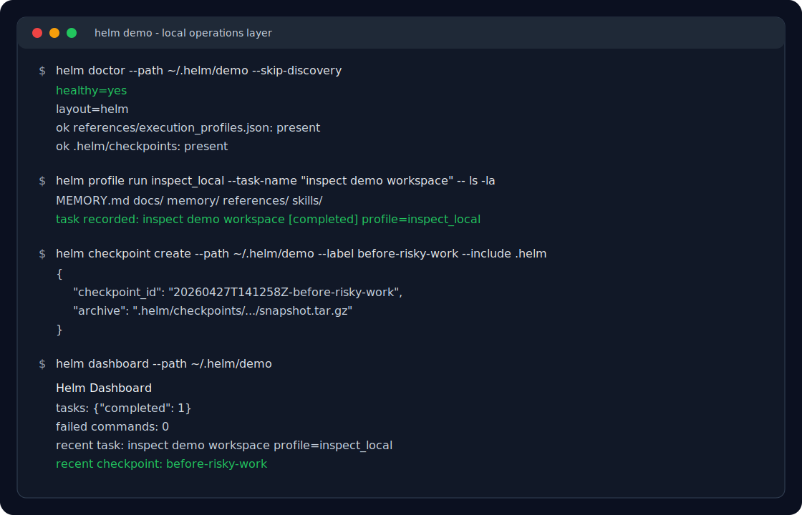

# Three-Minute Helm Demo

This demo shows Helm's core promise: profile a command, leave an audit trail, create a checkpoint, and inspect the resulting workspace state.



## 1. Install and initialize

```bash
curl -fsSL https://raw.githubusercontent.com/JDeun/Helm/main/install.sh | bash
helm doctor --path ~/.helm/workspace
```

## 2. Run a command under a read-only profile

```bash
helm profile --path ~/.helm/workspace run inspect_local \
  --task-name "inspect current repository" \
  -- git status --short
```

Helm records the task name, profile, command, guard decision, and result in local workspace files.

## 3. Create a checkpoint before risky work

```bash
helm checkpoint create --path ~/.helm/workspace \
  --label before-risky-work \
  --include ~/.helm/workspace
```

Checkpoints give repeated agent work a visible recovery point before broad edits or experiments.

## 4. Inspect what Helm captured

```bash
helm status --path ~/.helm/workspace --brief
helm report --path ~/.helm/workspace --format markdown
helm dashboard --path ~/.helm/workspace
```

The result is a local operating record that survives after the chat session ends.

## What this proves

- Commands run with an explicit profile instead of implicit trust.
- Guard decisions are recorded before execution.
- Checkpoints are visible and queryable.
- Reports summarize what happened without a hosted service.
- Future agent sessions can rehydrate context from workspace state.
